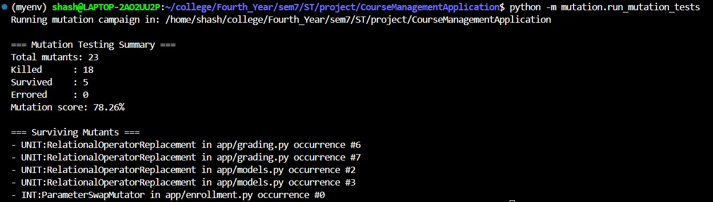
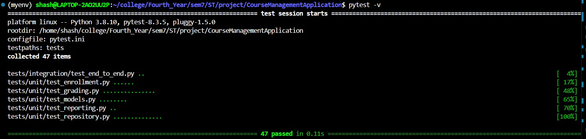
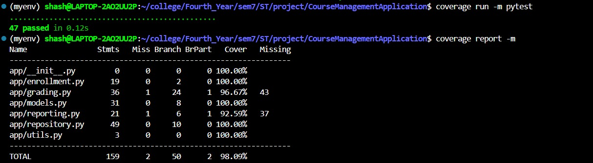

# 📘 Course Management System – Mutation Testing Project  
*Software Testing (ST) – Course Project*

---

## 1. Repository Link

Full project code repository (GitHub/Drive):  
**https://github.com/sassy2711/SoftwareTestingProject**

---

## 2. Project Overview

This project implements a **Course Management System** in Python and applies **Mutation Testing** at both:

- **Unit level** (within functions/methods)  
- **Integration level** (across interacting modules)

The system includes functionality for:

- Managing **students**, **courses**, **enrollments**
- Computing **grades** and **GPA**
- Generating **student reports**

Extensive unit and integration tests are designed using structured testing strategies from the course.

Mutation testing is performed using a **custom AST-based mutation framework** with independent unit-level and integration-level mutation operators.

---

## 3. Test Case Strategy Used

From the course’s required testing strategies, this project uses:

### **✔ Equivalence Class Partitioning (ECP)**  
Used for designing tests around valid and invalid inputs (e.g., score ranges, GPA computation, repository insertion rules).

### **✔ Boundary Value Analysis (BVA)**  
Applied to grade thresholds (90, 80, 70, 60), course capacity limits, and student year/senior status.

### **✔ Structural Testing using PyTest Coverage Reports**  
- Achieved **91%+ total coverage**
- Achieved **100% coverage** for several modules

### **✔ Mutation Testing (Strong Mutation)**  
Mutants are strongly killed when test assertions detect behavioral differences.

---

## 4. Mutation Testing Details

Mutation testing is implemented using custom AST transformations.

### **Unit-level Mutation Operators (≥3 required → 3 used)**

1. **ArithmeticOperatorReplacement**  
   - Mutates `+ ↔ -`, `* ↔ /`

2. **RelationalOperatorReplacement**  
   - Mutates `<`, `<=`, `>`, `>=`, `==`, `!=`

3. **LogicalConnectorReplacement**  
   - Mutates `and ↔ or`

---

### **Integration-level Mutation Operators (≥3 required → 3 used)**

1. **ParameterSwapMutator**  
   Swaps parameters of function calls across modules (e.g., grading functions).

2. **CallDeletionMutator**  
   Deletes integration-level calls between modules (e.g., removes score-recording logic).

3. **ReturnValueModificationMutator**  
   Breaks integration boundaries by altering returned values.

---

### Mutation Execution Summary

Surviving mutants include:

- **Equivalent mutant**  
  - `INT:ParameterSwapMutator` on `compute_grade_with_bonus` (commutative behavior: `score + bonus`)
  
- **Boundary-sensitive mutants**  
  - 2 mutants in `grading.py`
  - 2 mutants in `models.py`

After adding BVA tests, the mutation score improved from ~60% to **78.26%**.



---

## 5. Designed Test Cases

All test cases are located in the `tests/` directory:

tests/
│── unit/
│ ├── test_models.py
│ ├── test_grading.py
│ ├── test_enrollment.py
│ ├── test_reporting.py
│ └── test_repository.py
└── integration/
└── test_end_to_end.py


Tests cover:

- Models (Student, Course, Enrollment)
- Grade computation & GPA logic
- Enrollment rules & business constraints
- Repository error handling & operations
- Report generation logic
- Full end-to-end workflows

A total of **47 test cases** are implemented.



---

### Coverage Summary

The project achieves an overall coverage of **98.09%**:

- 100% coverage in **enrollment**, **models**, **repository**, **utils**
- 96.67% coverage in **grading**
- 92.59% coverage in **reporting**

This satisfies the structural testing requirement of the project and demonstrates thorough test design.




---

## 🛠 6. Open-Source Tools Used

| Purpose | Tool |
|--------|------|
| Testing framework | **pytest** |
| Code coverage | **coverage.py** |
| Mutation testing | **Custom Python AST-based mutator + astor** |
| Environment | Python 3.8+ |
| Automation | `subprocess`, `tempfile`, custom driver |

---

## 7. How to Run the Project

### **1. Create environment**

```bash
python3 -m venv myenv
source myenv/bin/activate   # Linux/Mac
# or
myenv\Scripts\activate.bat  # Windows
```

### **2. Install dependencies**
```bash
pip install -r requirements.txt
```

### **3. Run all tests**
```bash
pytest -v
```

### **4. Run coverage**
```bash
coverage run -m pytest
coverage report -m
```

### **5. Run mutation testing**
```bash
python -m mutation.run_mutation_tests
```

---

## 8. Included Files (For Submission ZIP)

Your compressed file should contain:

```
/app                  – Application source code
/tests                – All unit + integration tests
/mutation             – Mutation testing framework
pytest.ini            – Pytest configuration
.coveragerc           – Coverage configuration
requirements.txt      – Dependencies
README.md             – This README
Screenshots/          – Test & mutation execution results
Repository link       – Insert your GitHub/hosted repo link
```

---

## 9. Conclusion

This project demonstrates:

- Application of ECP, BVA, and structural testing  
- Comprehensive test suite with high coverage  
- Custom mutation testing with 6 powerful operators  
- Strong mutation analysis and improvement  
- Complete automation of testing and mutation pipeline  

This fully satisfies the Software Testing Project requirements.
